Rotenone Mortality
================
Vincent Tam
February 12, 2019

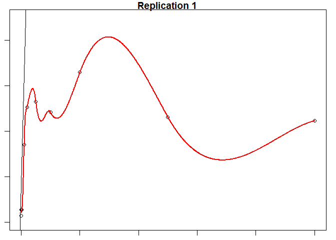

    ## 
    ## Call:
    ## lm(formula = mortality$`Log Concentration (micromolar)` ~ mortality$`Grp 1 Dead`)
    ## 
    ## Residuals:
    ##     Min      1Q  Median      3Q     Max 
    ## -1.6365 -0.6935 -0.1116  0.9462  1.3852 
    ## 
    ## Coefficients:
    ##                         Estimate Std. Error t value Pr(>|t|)  
    ## (Intercept)            -1.421424   0.640983  -2.218   0.0574 .
    ## mortality$`Grp 1 Dead`  0.004456   0.003378   1.319   0.2237  
    ## ---
    ## Signif. codes:  0 '***' 0.001 '**' 0.01 '*' 0.05 '.' 0.1 ' ' 1
    ## 
    ## Residual standard error: 1.098 on 8 degrees of freedom
    ## Multiple R-squared:  0.1786, Adjusted R-squared:  0.07596 
    ## F-statistic:  1.74 on 1 and 8 DF,  p-value: 0.2237

    ##          1          2          3          4          5          6 
    ## -1.3144841 -1.3634981 -1.3011166 -0.6238326 -0.1069579 -0.2673673 
    ##          7          8          9         10 
    ## -0.5525395 -0.1114137 -0.7797861 -0.6862140

    ## # A tibble: 2 x 5
    ##   term                   estimate std.error statistic p.value
    ##   <chr>                     <dbl>     <dbl>     <dbl>   <dbl>
    ## 1 (Intercept)            -1.42      0.641       -2.22  0.0574
    ## 2 mortality$`Grp 1 Dead`  0.00446   0.00338      1.32  0.224

    ## 
    ## Call:
    ## glm(formula = factor(mortality$`Log Concentration (micromolar)`) ~ 
    ##     mortality$`Grp 1 Dead`, family = binomial(link = "logit"))
    ## 
    ## Deviance Residuals: 
    ##        Min          1Q      Median          3Q         Max  
    ## -5.176e-05   2.100e-08   2.100e-08   2.100e-08   6.247e-05  
    ## 
    ## Coefficients:
    ##                         Estimate Std. Error z value Pr(>|z|)
    ## (Intercept)              -68.278  39632.039  -0.002    0.999
    ## mortality$`Grp 1 Dead`     3.681   1956.504   0.002    0.998
    ## 
    ## (Dispersion parameter for binomial family taken to be 1)
    ## 
    ##     Null deviance: 6.5017e+00  on 9  degrees of freedom
    ## Residual deviance: 6.5811e-09  on 8  degrees of freedom
    ## AIC: 4
    ## 
    ## Number of Fisher Scoring iterations: 25

    ##            1            2            3            4            5 
    ## 1.000000e+00 1.339598e-09 1.000000e+00 1.000000e+00 1.000000e+00 
    ##            6            7            8            9           10 
    ## 1.000000e+00 1.000000e+00 1.000000e+00 1.000000e+00 1.000000e+00

    ## # A tibble: 2 x 5
    ##   term                   estimate std.error statistic p.value
    ##   <chr>                     <dbl>     <dbl>     <dbl>   <dbl>
    ## 1 (Intercept)              -68.3     39632.  -0.00172   0.999
    ## 2 mortality$`Grp 1 Dead`     3.68     1957.   0.00188   0.998

    ##              Dose       SE
    ## p = 0.5: 18.55107 2919.175

    ##    Concentration Mortality     Fitted    Predicted
    ## 1        0.00000        24 -1.3144841 1.000000e+00
    ## 2       -3.00000        13 -1.3634981 1.339598e-09
    ## 3       -2.00000        27 -1.3011166 1.000000e+00
    ## 4       -1.30103       179 -0.6238326 1.000000e+00
    ## 5       -1.00000       295 -0.1069579 1.000000e+00
    ## 6       -0.60206       259 -0.2673673 1.000000e+00
    ## 7       -0.30103       195 -0.5525395 1.000000e+00
    ## 8        0.00000       294 -0.1114137 1.000000e+00
    ## 9        0.39794       144 -0.7797861 1.000000e+00
    ## 10       0.69897       165 -0.6862140 1.000000e+00

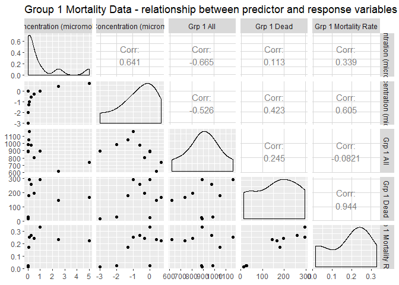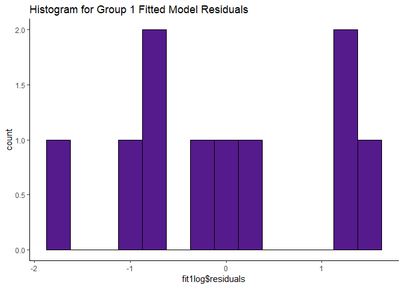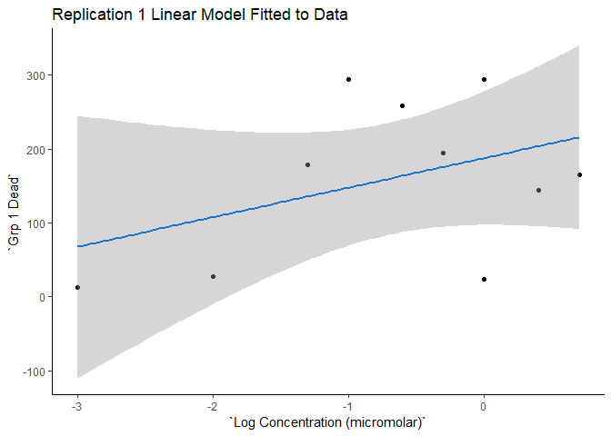

    ## 
    ## Call:
    ## lm(formula = mortality$`Concentration (micromolar)` ~ mortality$`Grp 1 Mortality Rate`)
    ## 
    ## Residuals:
    ##     Min      1Q  Median      3Q     Max 
    ## -1.2022 -0.8268 -0.4406 -0.1633  3.8431 
    ## 
    ## Coefficients:
    ##                                  Estimate Std. Error t value Pr(>|t|)
    ## (Intercept)                       0.08094    0.98679   0.082    0.937
    ## mortality$`Grp 1 Mortality Rate`  4.81883    4.72512   1.020    0.338
    ## 
    ## Residual standard error: 1.62 on 8 degrees of freedom
    ## Multiple R-squared:  0.115,  Adjusted R-squared:  0.004431 
    ## F-statistic:  1.04 on 1 and 8 DF,  p-value: 0.3377

    ##         1         2         3         4         5         6         7 
    ## 0.2119115 0.1511649 0.2127575 0.9039991 1.3022028 1.3610147 1.2453370 
    ##         8         9        10 
    ## 1.6692049 1.1965491 1.1568585

    ## # A tibble: 2 x 5
    ##   term                             estimate std.error statistic p.value
    ##   <chr>                               <dbl>     <dbl>     <dbl>   <dbl>
    ## 1 (Intercept)                        0.0809     0.987    0.0820   0.937
    ## 2 mortality$`Grp 1 Mortality Rate`   4.82       4.73     1.02     0.338

    ## 
    ## Call:
    ## glm(formula = factor(mortality$`Concentration (micromolar)`) ~ 
    ##     mortality$`Grp 1 Mortality Rate`, family = binomial(link = "logit"))
    ## 
    ## Deviance Residuals: 
    ##      Min        1Q    Median        3Q       Max  
    ## -1.54673   0.05413   0.07411   0.14427   0.96164  
    ## 
    ## Coefficients:
    ##                                  Estimate Std. Error z value Pr(>|z|)
    ## (Intercept)                        0.1789     1.5701   0.114    0.909
    ## mortality$`Grp 1 Mortality Rate`  24.1835    33.6554   0.719    0.472
    ## 
    ## (Dispersion parameter for binomial family taken to be 1)
    ## 
    ##     Null deviance: 6.5017  on 9  degrees of freedom
    ## Residual deviance: 4.0868  on 8  degrees of freedom
    ## AIC: 8.0868
    ## 
    ## Number of Fisher Scoring iterations: 8

    ##         1         2         3         4         5         6         7 
    ## 0.6976561 0.6297867 0.6985508 0.9867371 0.9981813 0.9986455 0.9975821 
    ##         8         9        10 
    ## 0.9997112 0.9969134 0.9962357

    ## # A tibble: 2 x 5
    ##   term                             estimate std.error statistic p.value
    ##   <chr>                               <dbl>     <dbl>     <dbl>   <dbl>
    ## 1 (Intercept)                         0.179      1.57     0.114   0.909
    ## 2 mortality$`Grp 1 Mortality Rate`   24.2       33.7      0.719   0.472

    ##                 Dose         SE
    ## p = 0.5: -0.00739562 0.07190727

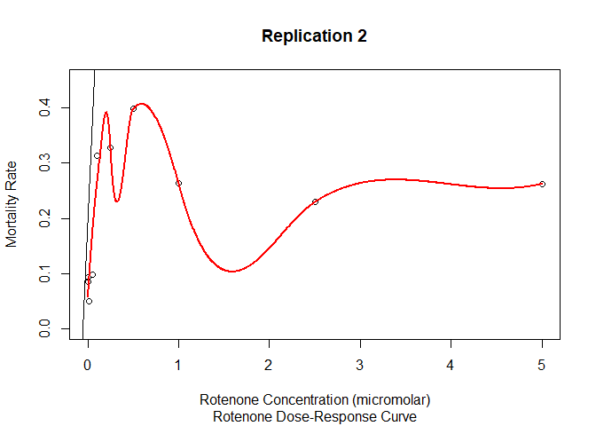

    ##    Concentration  Mortality    Fitted Predicted
    ## 1          0.000 0.02718007 0.2119115 0.6976561
    ## 2          0.001 0.01457399 0.1511649 0.6297867
    ## 3          0.010 0.02735562 0.2127575 0.6985508
    ## 4          0.050 0.17080153 0.9039991 0.9867371
    ## 5          0.100 0.25343643 1.3022028 0.9981813
    ## 6          0.250 0.26564103 1.3610147 0.9986455
    ## 7          0.500 0.24163569 1.2453370 0.9975821
    ## 8          1.000 0.32959641 1.6692049 0.9997112
    ## 9          2.500 0.23151125 1.1965491 0.9969134
    ## 10         5.000 0.22327470 1.1568585 0.9962357

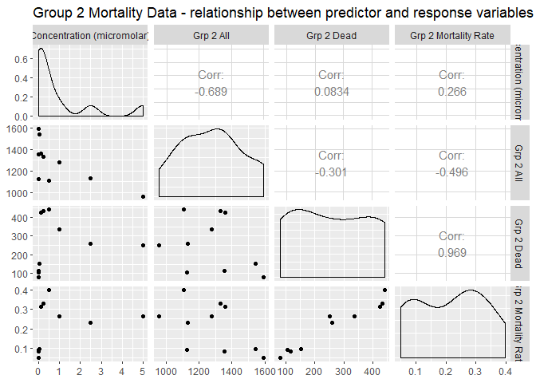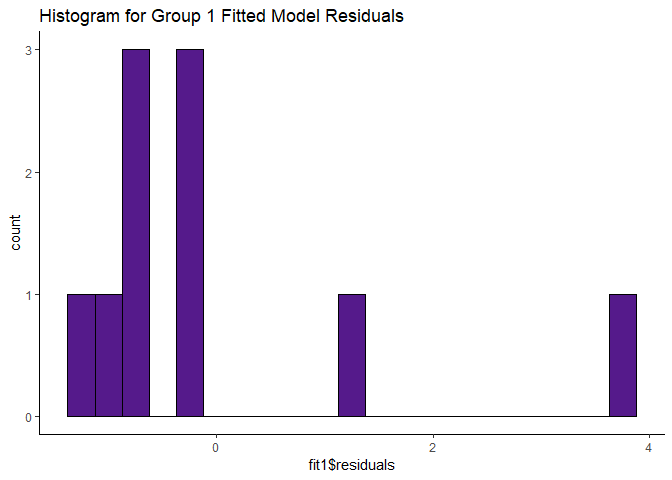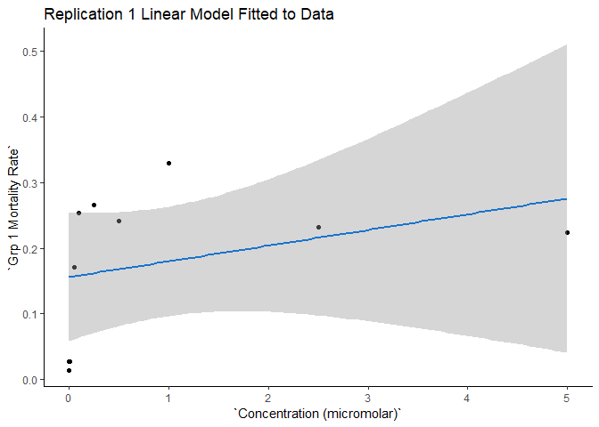

    ## 
    ## Call:
    ## lm(formula = mortality$`Concentration (micromolar)` ~ mortality$`Grp 2 Mortality Rate`)
    ## 
    ## Residuals:
    ##     Min      1Q  Median      3Q     Max 
    ## -1.2004 -0.9545 -0.4889 -0.1804  3.8806 
    ## 
    ## Coefficients:
    ##                                  Estimate Std. Error t value Pr(>|t|)
    ## (Intercept)                        0.1899     1.0977   0.173    0.867
    ## mortality$`Grp 2 Mortality Rate`   3.5478     4.5533   0.779    0.458
    ## 
    ## Residual standard error: 1.66 on 8 degrees of freedom
    ## Multiple R-squared:  0.07054,    Adjusted R-squared:  -0.04564 
    ## F-statistic: 0.6071 on 1 and 8 DF,  p-value: 0.4583

    ##         1         2         3         4         5         6         7 
    ## 0.4912173 0.5207243 0.3658314 0.5366335 1.3003773 1.3493969 1.6007027 
    ##         8         9        10 
    ## 1.1219216 1.0047606 1.1194344

    ## # A tibble: 2 x 5
    ##   term                             estimate std.error statistic p.value
    ##   <chr>                               <dbl>     <dbl>     <dbl>   <dbl>
    ## 1 (Intercept)                         0.190      1.10     0.173   0.867
    ## 2 mortality$`Grp 2 Mortality Rate`    3.55       4.55     0.779   0.458

    ## 
    ## Call:
    ## glm(formula = factor(mortality$`Concentration (micromolar)`) ~ 
    ##     mortality$`Grp 2 Mortality Rate`, family = binomial(link = "logit"))
    ## 
    ## Deviance Residuals: 
    ##      Min        1Q    Median        3Q       Max  
    ## -1.73817   0.08303   0.14550   0.52556   0.93260  
    ## 
    ## Coefficients:
    ##                                  Estimate Std. Error z value Pr(>|z|)
    ## (Intercept)                       -0.3099     2.3857  -0.130    0.897
    ## mortality$`Grp 2 Mortality Rate`  18.4979    23.3103   0.794    0.427
    ## 
    ## (Dispersion parameter for binomial family taken to be 1)
    ## 
    ##     Null deviance: 6.5017  on 9  degrees of freedom
    ## Residual deviance: 4.8269  on 8  degrees of freedom
    ## AIC: 8.8269
    ## 
    ## Number of Fisher Scoring iterations: 7

    ##         1         2         3         4         5         6         7 
    ## 0.7792257 0.8045542 0.6473507 0.8172691 0.9958480 0.9967814 0.9991298 
    ##         8         9        10 
    ## 0.9895388 0.9808986 0.9894037

    ## # A tibble: 2 x 5
    ##   term                             estimate std.error statistic p.value
    ##   <chr>                               <dbl>     <dbl>     <dbl>   <dbl>
    ## 1 (Intercept)                        -0.310      2.39    -0.130   0.897
    ## 2 mortality$`Grp 2 Mortality Rate`   18.5       23.3      0.794   0.427

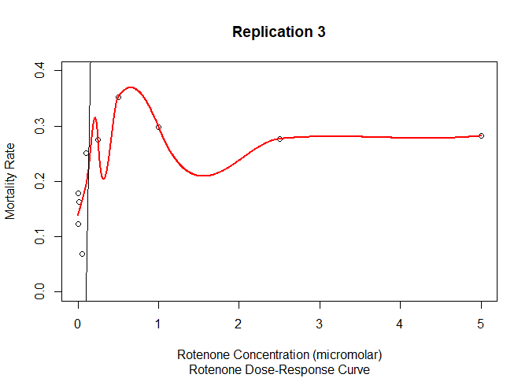

    ##    Concentration  Mortality    Fitted Predicted
    ## 1          0.000 0.08493353 0.4912173 0.7792257
    ## 2          0.001 0.09325044 0.5207243 0.8045542
    ## 3          0.010 0.04959197 0.3658314 0.6473507
    ## 4          0.050 0.09773463 0.5366335 0.8172691
    ## 5          0.100 0.31300514 1.3003773 0.9958480
    ## 6          0.250 0.32682194 1.3493969 0.9967814
    ## 7          0.500 0.39765555 1.6007027 0.9991298
    ## 8          1.000 0.26270524 1.1219216 0.9895388
    ## 9          2.500 0.22968198 1.0047606 0.9808986
    ## 10         5.000 0.26200418 1.1194344 0.9894037

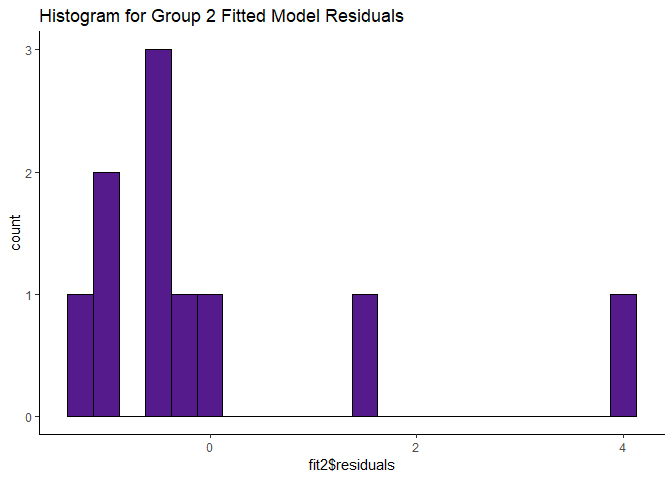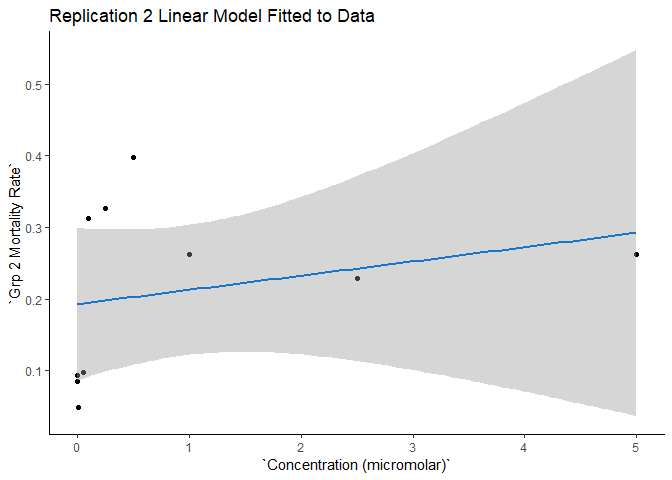

    ## 
    ## Call:
    ## lm(formula = mortality$`Concentration (micromolar)` ~ mortality$`Grp 3 Mortality Rate`)
    ## 
    ## Residuals:
    ##     Min      1Q  Median      3Q     Max 
    ## -1.3889 -0.9068 -0.4670  0.1887  3.6424 
    ## 
    ## Coefficients:
    ##                                  Estimate Std. Error t value Pr(>|t|)
    ## (Intercept)                       -0.7662     1.4134  -0.542    0.603
    ## mortality$`Grp 3 Mortality Rate`   7.5246     5.8339   1.290    0.233
    ## 
    ## Residual standard error: 1.567 on 8 degrees of freedom
    ## Multiple R-squared:  0.1722, Adjusted R-squared:  0.06867 
    ## F-statistic: 1.664 on 1 and 8 DF,  p-value: 0.2332

    ##          1          2          3          4          5          6 
    ##  0.1543654  0.5734950  0.4619692 -0.2530723  1.1182804  1.3100746 
    ##          7          8          9         10 
    ##  1.8888659  1.4820422  1.3173576  1.3576219

    ## # A tibble: 2 x 5
    ##   term                             estimate std.error statistic p.value
    ##   <chr>                               <dbl>     <dbl>     <dbl>   <dbl>
    ## 1 (Intercept)                        -0.766      1.41    -0.542   0.603
    ## 2 mortality$`Grp 3 Mortality Rate`    7.52       5.83     1.29    0.233

    ## 
    ## Call:
    ## glm(formula = factor(mortality$`Concentration (micromolar)`) ~ 
    ##     mortality$`Grp 3 Mortality Rate`, family = binomial(link = "logit"))
    ## 
    ## Deviance Residuals: 
    ##     Min       1Q   Median       3Q      Max  
    ## -1.7073   0.1566   0.1850   0.3979   1.1001  
    ## 
    ## Coefficients:
    ##                                  Estimate Std. Error z value Pr(>|z|)
    ## (Intercept)                        -1.085      2.673  -0.406    0.685
    ## mortality$`Grp 3 Mortality Rate`   18.610     17.614   1.057    0.291
    ## 
    ## (Dispersion parameter for binomial family taken to be 1)
    ## 
    ##     Null deviance: 6.5017  on 9  degrees of freedom
    ## Residual deviance: 4.7800  on 8  degrees of freedom
    ## AIC: 8.78
    ## 
    ## Number of Fisher Scoring iterations: 6

    ##         1         2         3         4         5         6         7 
    ## 0.7671541 0.9028179 0.8757843 0.5460206 0.9727835 0.9828877 0.9958571 
    ##         8         9        10 
    ## 0.9887494 0.9831881 0.9847573

    ## # A tibble: 2 x 5
    ##   term                             estimate std.error statistic p.value
    ##   <chr>                               <dbl>     <dbl>     <dbl>   <dbl>
    ## 1 (Intercept)                         -1.08      2.67    -0.406   0.685
    ## 2 mortality$`Grp 3 Mortality Rate`    18.6      17.6      1.06    0.291

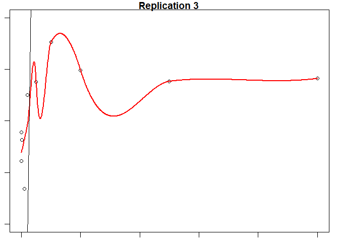

    ##    Concentration  Mortality     Fitted Predicted
    ## 1          0.000 0.12234043  0.1543654 0.7671541
    ## 2          0.001 0.17804154  0.5734950 0.9028179
    ## 3          0.010 0.16322009  0.4619692 0.8757843
    ## 4          0.050 0.06819313 -0.2530723 0.5460206
    ## 5          0.100 0.25044196  1.1182804 0.9727835
    ## 6          0.250 0.27593085  1.3100746 0.9828877
    ## 7          0.500 0.35285054  1.8888659 0.9958571
    ## 8          1.000 0.29878485  1.4820422 0.9887494
    ## 9          2.500 0.27689873  1.3173576 0.9831881
    ## 10         5.000 0.28224974  1.3576219 0.9847573

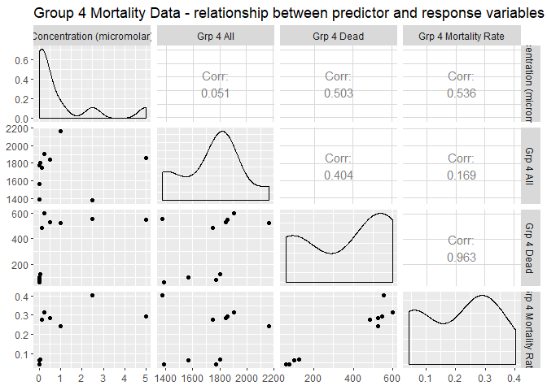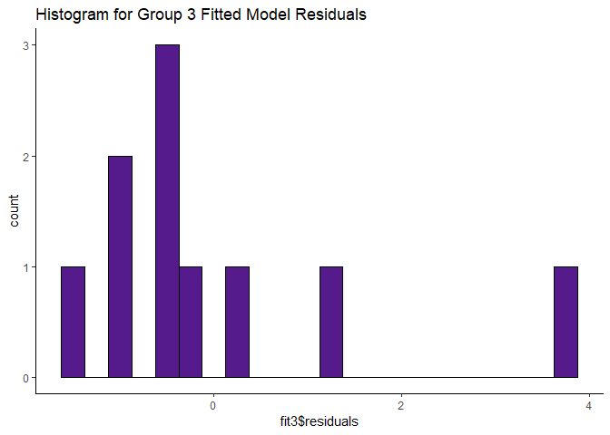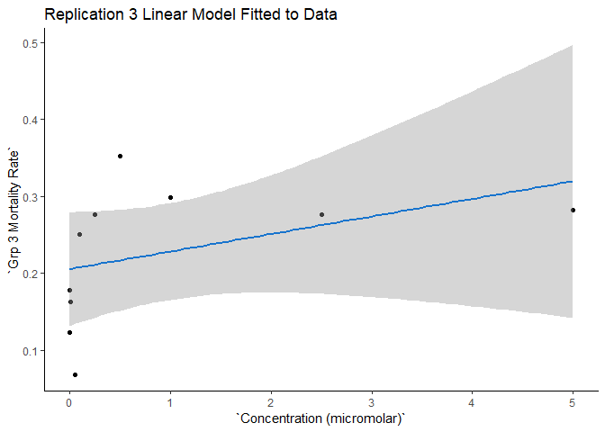

    ## 
    ## Call:
    ## lm(formula = mortality$`Concentration (micromolar)` ~ mortality$`Grp 4 Mortality Rate`)
    ## 
    ## Residuals:
    ##     Min      1Q  Median      3Q     Max 
    ## -1.4074 -0.7780 -0.0310  0.1035  3.4778 
    ## 
    ## Coefficients:
    ##                                  Estimate Std. Error t value Pr(>|t|)
    ## (Intercept)                       -0.3737     0.8647  -0.432    0.677
    ## mortality$`Grp 4 Mortality Rate`   6.4602     3.5981   1.795    0.110
    ## 
    ## Residual standard error: 1.454 on 8 degrees of freedom
    ## Multiple R-squared:  0.2872, Adjusted R-squared:  0.1981 
    ## F-statistic: 3.224 on 1 and 8 DF,  p-value: 0.1103

    ##           1           2           3           4           5           6 
    ## -0.10359993  0.03878443 -0.09334194  0.07413448  1.42240778  1.65739176 
    ##           7           8           9          10 
    ##  1.47353925  1.19128665  2.22816553  1.52223198

    ## # A tibble: 2 x 5
    ##   term                             estimate std.error statistic p.value
    ##   <chr>                               <dbl>     <dbl>     <dbl>   <dbl>
    ## 1 (Intercept)                        -0.374     0.865    -0.432   0.677
    ## 2 mortality$`Grp 4 Mortality Rate`    6.46      3.60      1.80    0.110

    ## 
    ## Call:
    ## glm(formula = factor(mortality$`Concentration (micromolar)`) ~ 
    ##     mortality$`Grp 4 Mortality Rate`, family = binomial(link = "logit"))
    ## 
    ## Deviance Residuals: 
    ##        Min          1Q      Median          3Q         Max  
    ## -2.454e-04   2.100e-08   2.100e-08   2.100e-08   2.500e-04  
    ## 
    ## Coefficients:
    ##                                   Estimate Std. Error z value Pr(>|z|)
    ## (Intercept)                         -928.5   131515.6  -0.007    0.994
    ## mortality$`Grp 4 Mortality Rate`   21790.2  3084822.2   0.007    0.994
    ## 
    ## (Dispersion parameter for binomial family taken to be 1)
    ## 
    ##     Null deviance: 6.5017e+00  on 9  degrees of freedom
    ## Residual deviance: 1.2270e-07  on 8  degrees of freedom
    ## AIC: 4
    ## 
    ## Number of Fisher Scoring iterations: 25

    ##            1            2            3            4            5 
    ## 3.009981e-08 1.000000e+00 1.000000e+00 1.000000e+00 1.000000e+00 
    ##            6            7            8            9           10 
    ## 1.000000e+00 1.000000e+00 1.000000e+00 1.000000e+00 1.000000e+00

    ## # A tibble: 2 x 5
    ##   term                             estimate std.error statistic p.value
    ##   <chr>                               <dbl>     <dbl>     <dbl>   <dbl>
    ## 1 (Intercept)                         -929.   131516.  -0.00706   0.994
    ## 2 mortality$`Grp 4 Mortality Rate`   21790.  3084822.   0.00706   0.994

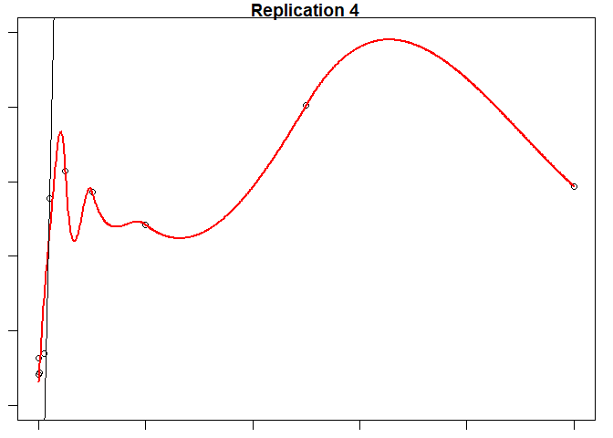

    ##    Concentration  Mortality      Fitted    Predicted
    ## 1          0.000 0.04181687 -0.10359993 3.009981e-08
    ## 2          0.001 0.06385696  0.03878443 1.000000e+00
    ## 3          0.010 0.04340473 -0.09334194 1.000000e+00
    ## 4          0.050 0.06932890  0.07413448 1.000000e+00
    ## 5          0.100 0.27803204  1.42240778 1.000000e+00
    ## 6          0.250 0.31440589  1.65739176 1.000000e+00
    ## 7          0.500 0.28594683  1.47353925 1.000000e+00
    ## 8          1.000 0.24225613  1.19128665 1.000000e+00
    ## 9          2.500 0.40275762  2.22816553 1.000000e+00
    ## 10         5.000 0.29348411  1.52223198 1.000000e+00

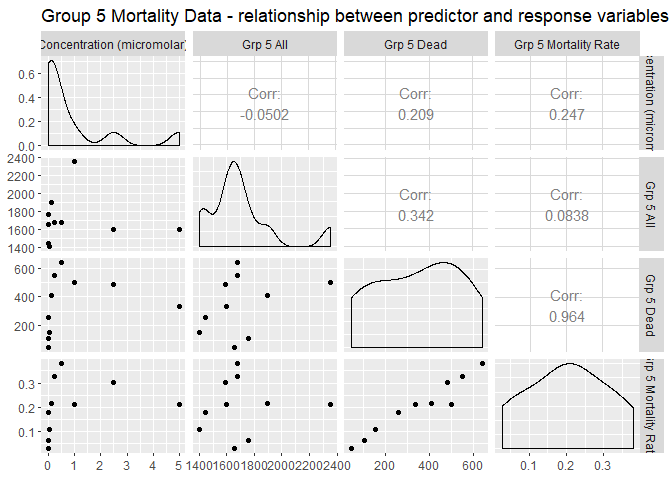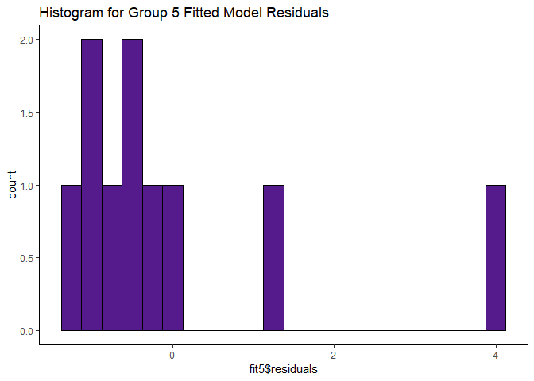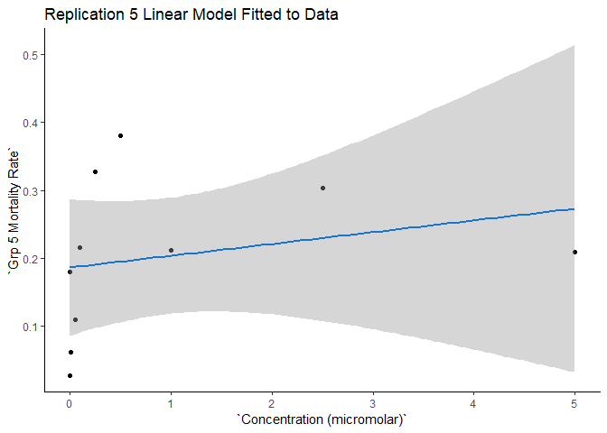

    ## 
    ## Call:
    ## lm(formula = mortality$`Concentration (micromolar)` ~ mortality$`Grp 5 Mortality Rate`)
    ## 
    ## Residuals:
    ##     Min      1Q  Median      3Q     Max 
    ## -1.1278 -0.8809 -0.4994 -0.0615  4.0337 
    ## 
    ## Coefficients:
    ##                                  Estimate Std. Error t value Pr(>|t|)
    ## (Intercept)                        0.2286     1.1204   0.204    0.843
    ## mortality$`Grp 5 Mortality Rate`   3.5148     4.8755   0.721    0.491
    ## 
    ## Residual standard error: 1.669 on 8 degrees of freedom
    ## Multiple R-squared:  0.061,  Adjusted R-squared:  -0.05637 
    ## F-statistic: 0.5197 on 1 and 8 DF,  p-value: 0.4915

    ##         1         2         3         4         5         6         7 
    ## 0.8609697 0.3262437 0.4443543 0.6143513 0.9875522 1.3777772 1.5649239 
    ##         8         9        10 
    ## 0.9736144 1.2949091 0.9663041

    ## # A tibble: 2 x 5
    ##   term                             estimate std.error statistic p.value
    ##   <chr>                               <dbl>     <dbl>     <dbl>   <dbl>
    ## 1 (Intercept)                         0.229      1.12     0.204   0.843
    ## 2 mortality$`Grp 5 Mortality Rate`    3.51       4.88     0.721   0.491

    ## 
    ## Call:
    ## glm(formula = factor(mortality$`Concentration (micromolar)`) ~ 
    ##     mortality$`Grp 5 Mortality Rate`, family = binomial(link = "logit"))
    ## 
    ## Deviance Residuals: 
    ##     Min       1Q   Median       3Q      Max  
    ## -2.1344   0.4017   0.4490   0.4876   0.5433  
    ## 
    ## Coefficients:
    ##                                  Estimate Std. Error z value Pr(>|z|)
    ## (Intercept)                         1.778      2.084   0.853    0.393
    ## mortality$`Grp 5 Mortality Rate`    2.175      9.842   0.221    0.825
    ## 
    ## (Dispersion parameter for binomial family taken to be 1)
    ## 
    ##     Null deviance: 6.5017  on 9  degrees of freedom
    ## Residual deviance: 6.4522  on 8  degrees of freedom
    ## AIC: 10.452
    ## 
    ## Number of Fisher Scoring iterations: 5

    ##         1         2         3         4         5         6         7 
    ## 0.8974986 0.8628044 0.8712304 0.8825805 0.9044848 0.9234094 0.9312101 
    ##         8         9        10 
    ## 0.9037369 0.9197024 0.9033426

    ## # A tibble: 2 x 5
    ##   term                             estimate std.error statistic p.value
    ##   <chr>                               <dbl>     <dbl>     <dbl>   <dbl>
    ## 1 (Intercept)                          1.78      2.08     0.853   0.393
    ## 2 mortality$`Grp 5 Mortality Rate`     2.18      9.84     0.221   0.825

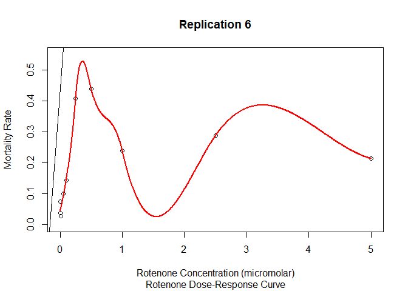

    ##    Concentration  Mortality    Fitted Predicted
    ## 1          0.000 0.17993080 0.8609697 0.8974986
    ## 2          0.001 0.02779456 0.3262437 0.8628044
    ## 3          0.010 0.06139852 0.4443543 0.8712304
    ## 4          0.050 0.10976479 0.6143513 0.8825805
    ## 5          0.100 0.21594509 0.9875522 0.9044848
    ## 6          0.250 0.32696897 1.3777772 0.9234094
    ## 7          0.500 0.38021454 1.5649239 0.9312101
    ## 8          1.000 0.21197961 0.9736144 0.9037369
    ## 9          2.500 0.30339196 1.2949091 0.9197024
    ## 10         5.000 0.20989975 0.9663041 0.9033426

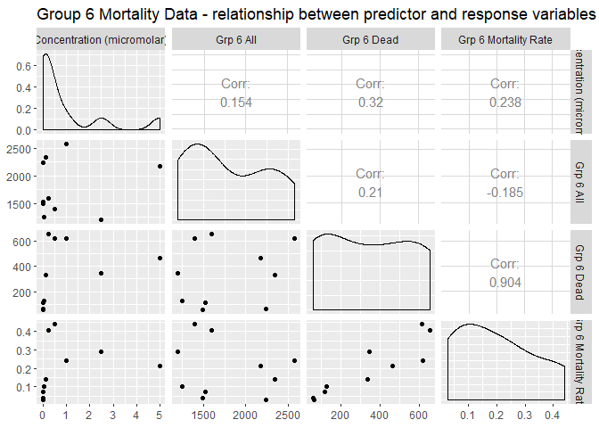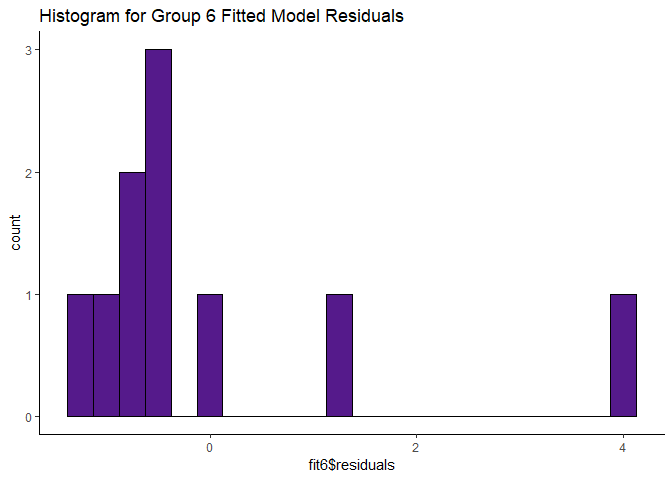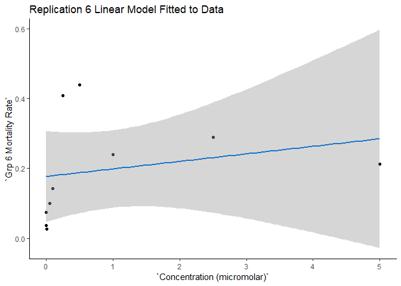

    ## 
    ## Call:
    ## lm(formula = mortality$`Concentration (micromolar)` ~ mortality$`Grp 6 Mortality Rate`)
    ## 
    ## Residuals:
    ##     Min      1Q  Median      3Q     Max 
    ## -1.2447 -0.6833 -0.5704 -0.1608  4.0172 
    ## 
    ## Coefficients:
    ##                                  Estimate Std. Error t value Pr(>|t|)
    ## (Intercept)                        0.4249     0.9138   0.465    0.654
    ## mortality$`Grp 6 Mortality Rate`   2.6164     3.7769   0.693    0.508
    ## 
    ## Residual standard error: 1.672 on 8 degrees of freedom
    ## Multiple R-squared:  0.05659,    Adjusted R-squared:  -0.06134 
    ## F-statistic: 0.4799 on 1 and 8 DF,  p-value: 0.5081

    ##         1         2         3         4         5         6         7 
    ## 0.5214304 0.6203105 0.4962614 0.6883745 0.7983044 1.4946779 1.5760699 
    ##         8         9        10 
    ## 1.0523016 1.1805079 0.9827616

    ## # A tibble: 2 x 5
    ##   term                             estimate std.error statistic p.value
    ##   <chr>                               <dbl>     <dbl>     <dbl>   <dbl>
    ## 1 (Intercept)                         0.425     0.914     0.465   0.654
    ## 2 mortality$`Grp 6 Mortality Rate`    2.62      3.78      0.693   0.508

    ## 
    ## Call:
    ## glm(formula = factor(mortality$`Concentration (micromolar)`) ~ 
    ##     mortality$`Grp 6 Mortality Rate`, family = binomial(link = "logit"))
    ## 
    ## Deviance Residuals: 
    ##      Min        1Q    Median        3Q       Max  
    ## -1.38135   0.00049   0.00902   0.18003   1.18904  
    ## 
    ## Coefficients:
    ##                                  Estimate Std. Error z value Pr(>|z|)
    ## (Intercept)                        -1.432      2.894  -0.495    0.621
    ## mortality$`Grp 6 Mortality Rate`   51.454     63.577   0.809    0.418
    ## 
    ## (Dispersion parameter for binomial family taken to be 1)
    ## 
    ##     Null deviance: 6.5017  on 9  degrees of freedom
    ## Residual deviance: 3.5456  on 8  degrees of freedom
    ## AIC: 7.5456
    ## 
    ## Number of Fisher Scoring iterations: 9

    ##         1         2         3         4         5         6         7 
    ## 0.6148266 0.9177540 0.4931693 0.9770396 0.9973022 1.0000000 1.0000000 
    ##         8         9        10 
    ## 0.9999817 0.9999985 0.9999281

    ## # A tibble: 2 x 5
    ##   term                             estimate std.error statistic p.value
    ##   <chr>                               <dbl>     <dbl>     <dbl>   <dbl>
    ## 1 (Intercept)                         -1.43      2.89    -0.495   0.621
    ## 2 mortality$`Grp 6 Mortality Rate`    51.5      63.6      0.809   0.418

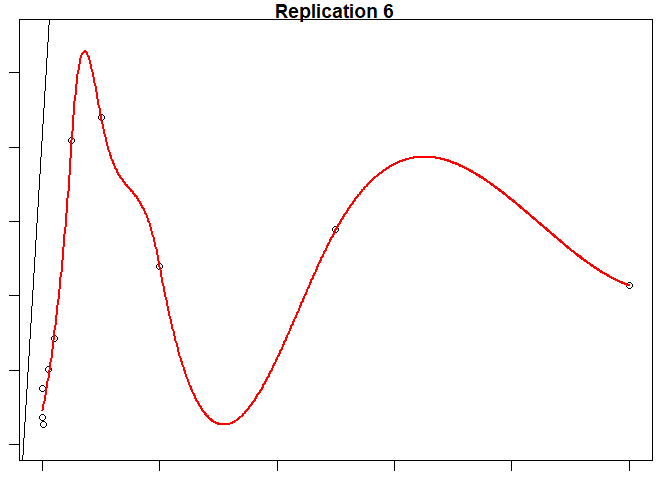

    ##    Concentration  Mortality    Fitted Predicted
    ## 1          0.000 0.03691275 0.5214304 0.6148266
    ## 2          0.001 0.07470511 0.6203105 0.9177540
    ## 3          0.010 0.02729306 0.4962614 0.4931693
    ## 4          0.050 0.10071942 0.6883745 0.9770396
    ## 5          0.100 0.14273504 0.7983044 0.9973022
    ## 6          0.250 0.40889167 1.4946779 1.0000000
    ## 7          0.500 0.44000000 1.5760699 1.0000000
    ## 8          1.000 0.23981374 1.0523016 0.9999817
    ## 9          2.500 0.28881469 1.1805079 0.9999985
    ## 10         5.000 0.21323529 0.9827616 0.9999281

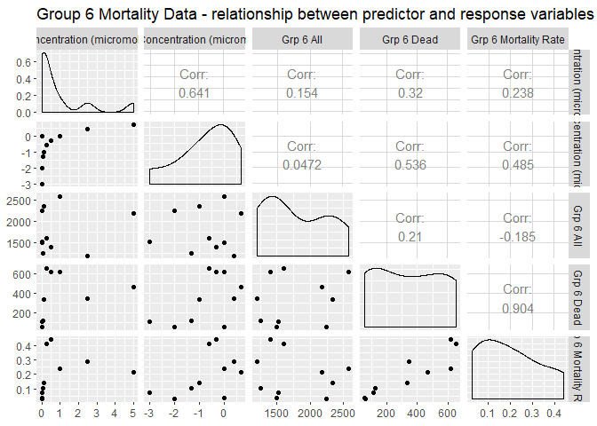
